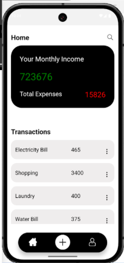
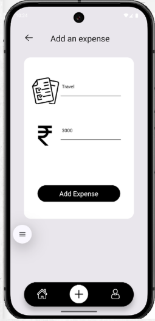

# 💸 Expense Tracker App

A modern **React Native Expense Tracker** application that helps users manage daily expenses efficiently. Users can add, edit, and delete expenses while keeping track of their spending through a clean and intuitive interface.

---

# 📱 Screenshots

## 🚀 Onboarding Screen

<p align="center">
  
</p>

---

## 🔐 Login Screen

<p align="center">
  
</p>

---

## 📝 Sign Up Screen

<p align="center">
  
</p>

---

## 🏠 Home Screen

<p align="center">
  
</p>

---

## ➕ Add Expense

<p align="center">
  
</p>

---

## 📋 Expense Details Modal

<p align="center">
  
</p>

---

# ✨ Features

- ➕ Add Expenses
- ✏️ Edit Expenses
- ❌ Delete Expenses
- 📜 View Expense History
- 📱 Clean & Responsive UI
- ⚡ Fast Performance

---

# 🛠️ Tech Stack

- React Native
- JavaScript
- React Hooks
- Fetch API
- StyleSheet

---

# 📂 Project Structure

```
ExpenseTracker/
│
├── Assets/
├── Components/
├── Screens/
├── screenshots/
│   ├── onboarding.png
│   ├── login.png
│   ├── signup.png
│   ├── home.png
│   ├── addexpense.png
│   └── modal.png
├── App.js
├── package.json
└── README.md
```

---

# 🚀 Installation

```bash
git clone https://github.com/your-username/ExpenseTracker.git

cd ExpenseTracker

npm install

npx react-native start

npx react-native run-android
```

---

# 🚧 Future Enhancements

- 🔐 Firebase Authentication
- ☁️ Cloud Backup
- 📊 Expense Analytics
- 🌙 Dark Mode
- 🏷️ Expense Categories
- 📅 Monthly Reports

---

# 👩‍💻 Author

**Babita Mittal**

🌐 Portfolio: https://portfoliobabita.vercel.app/

---

## ⭐ Support

If you like this project, please consider giving it a **⭐ Star** on GitHub.
